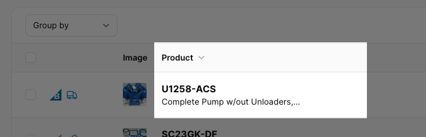
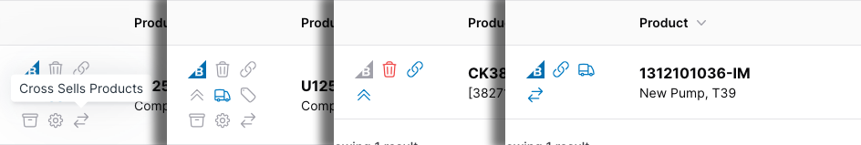

# Filament Toolbox

[](https://packagist.org/packages/unexpectedjourney/filament-toolbox)
[](https://github.com/unexpectedjourney/filament-toolbox/actions?query=workflow%3Arun-tests+branch%3Amain)
[](https://github.com/unexpectedjourney/filament-toolbox/actions?query=workflow%3A"Fix+PHP+code+style+issues"+branch%3Amain)
[](https://packagist.org/packages/unexpectedjourney/filament-toolbox)


Filament Toolbox is a collection of components for the Filament ecosystem.

## Installation

You can install the package via composer:

```bash
composer require unexpectedjourney/filament-toolbox
```


## Components

* Table Columns
    * Heading and Detail Column
    * Flag Column

### Heading and Detail Column



The Heading and Detail Column is a way to display two separate values in the same column. This can be done natively in Filament with a `TextColumn` and `description()` but it lacks some features like built in limiting of the detail and automatic tooltips when either the heading or detail is limited.

#### Usage

Create a `HeadingDetailColumn` just like you would a `TextColumn` and chain a call to `detail()` to provide the detail contents.

```PHP
use UnexpectedJourney\FilamentToolbox\Tables\Columns\HeadingDetailColumn;

HeadingDetailColumn::make('sku')
    ->detail(fn(Product $record): string => $record->name)
```

To control exactly what content shows in the heading you may use the `heading()` method.

```PHP
use UnexpectedJourney\FilamentToolbox\Tables\Columns\HeadingDetailColumn;

HeadingDetailColumn::make('sku')
    ->heading(fn(Product $record): string => str($record->sku)->upper())
    ->detail(fn(Product $record): string => $record->name)
```

Use the `limit()` or `words()` methods to apply a limit to the number or characters or words displayed in both the heading and detail. The column detects when the limit is applied and adds a Tooltip with the full content when necessary.

```PHP
HeadingDetailColumn::make('sku')
    ->detail(fn(Product $record): string => $record->name)
    ->limit(30)
```

Use the `limitHeading()`, `wordsHeading()`, `limitDetail()`, and `wordsDetail()` methods to limit the number of characters or words displayed in the heading or detail separately. Tooltips will be intelligently added as needed.

```PHP
HeadingDetailColumn::make('sku')
    ->detail(fn(Product $record): string => $record->name)
    ->limitHeading(100)
    ->limitDetail(30)
```

If you do not want tooltips displayed you can disable them using the `showTooltipsWhenLimited()` to handle display for tooltips for both the heading and detail or by using `showHeadingTooltipWhenLimited()` and `showDetailTooltipWhenLimited()` methods to manage tooltips for the heading and detail respectively.

```PHP
HeadingDetailColumn::make('sku')
    ->detail(fn(Product $record): string => $record->name)
    ->showTooltipsWhenLimited(false)
    ->limitDetail(30)
```

### Flag Column



The Flag column is used to display boolean icons for a number of true/false values on your model. Similar results can be had using Filament's built in `IconColumn` but the Flag Column has some extra features like tooltips or urls for each icon and displaying the icons in a grid.

#### Usage

##### Preparing your model
Your model needs an attribute that returns an array where the keys are the name of the flag and the values are the active state. This can be a JSON column or a custom Attribute getter.

##### Add the column

Add the `FlagColumn` to your columns array and call `flags()` passing an array of `Flag`s to it. Each `Flag` must have a name that corresponds to the name of a flag in the column's state and an optional icon name for display.

```PHP
use UnexpectedJourney\FilamentToolbox\Tables\Columns\FlagColumn;
use UnexpectedJourney\FilamentToolbox\Tables\Columns\FlagColumn\Flag;

FLagColumn::make('flags')
    ->flags([
        Flag::make('trashed', 'heroicon-o-trash'),
        Flag::make('on_sale', 'heroicon-o-tag'),
        Flag::make('bundle', 'heroicon-o-archive-box')
    ])
```
Note: If the name used when making the flag does not exist as a key in the column's state, it will be considered inactive.

You may specify the icon used by using the dedicated `icon()` method if you prefer. Where ever you specify the icon you may pass a closure instead of a string. Using Filament's magic closures, add `$active` as one of the arguments to get the active state of the flag .
```PHP
FLagColumn::make('flags')
    ->flags([
        Flag::make('trashed', 'heroicon-o-trash'),
        Flag::make('on_sale', 'heroicon-o-tag'),
        Flag::make('bundle', 'heroicon-o-archive-box'),
        Flag::make('visible')
            ->icon(fn(bool $active): string => $active
                ? 'heroicon-o-eye'
                : 'heroicon-o-eye-slash')
        
    ])
```

##### Customizing the display order
The flags are displayed in the order they appear in the `flags()` method and by default flags that are inactive are hidden.

##### Showing inactive flags

To show all flags including inactive, use the `showInactive()` method on the `FlagColumn` itself.
```PHP
FLagColumn::make('flags')
    ->showInactive()
    ->flags([
        Flag::make('trashed', 'heroicon-o-trash'),
        Flag::make('on_sale', 'heroicon-o-tag'),
        Flag::make('bundle', 'heroicon-o-archive-box')
    ])
```

Showing or hiding inactive flags can also be done on a per-flag basis by calling `showWhenInactive()`. You may pass a closure to conditionally show the icon if it's inactive. 

```PHP
FLagColumn::make('flags')
    ->flags([
        Flag::make('trashed', 'heroicon-o-trash')
            ->showWhenInactive(),
        Flag::make('on_sale', 'heroicon-o-tag'),
        Flag::make('bundle', 'heroicon-o-archive-box')
    ])
```

Note: Using `showWhenInactive()` on a flag will override `showInactive()` called on the `FlagColumn`. 

##### Changing the colors
By default, active flags will use the primary color of your Filament theme and inactive flags will use a gray color. You may change this for the entire `FlagColumn` or on each specific flag by calling the `activeColor()` and `inactiveColor()` methods.

Note: Colors defined on a flag will override colors defined on the `FlagColumn`.

```PHP
use Filament\Support\Colors\Color;

FLagColumn::make('flags')
    ->activeColor('success')
    ->inactiveColor(Color::Stone)
    ->flags([
        Flag::make('trashed', 'heroicon-o-trash')
            ->activeColor('danger'),
        Flag::make('on_sale', 'heroicon-o-tag'),
        Flag::make('bundle', 'heroicon-o-archive-box')
    ])
```

##### Default icons

If an icon is not specified for a flag a default icon will be used. The default active icon is 'heroicon-o-check-circle' and the default inactive icon is 'heroicon-o-x-circle'. Call the 'activeIcon()' and 'inactiveIcon()' methods on the `FlagColumn` to set their respective icons.

```PHP
FLagColumn::make('flags')
    ->activeIcon('heroicon-o-check')
    ->inactiveIcon('heroicon-o-x-mark')
    ->flags([...])
```

##### Customizing the grid
By default, the FlagColumn displays the flags in a grid of 3 icons. This is controlled much the same way that Filament layout components like `Filament\Tables\Columns\Layout\Grid` control their grid. Call the `columns()`. Refer to Filament's documentation for further details: https://filamentphp.com/docs/3.x/tables/layout#controlling-column-width-using-a-grid 
```

##### Tooltips
Tooltips are hidden by default but can be shown for all flags calling the `showTooltips()` method on the `FlagColumn`. 

```PHP
FLagColumn::make('flags')
    ->showTooltips()
    ->flags([...])
```

Tooltips are a title cased string automatically generated from the name of the flag. You may specify your own tooltip by calling the `tooltip()` method on an individual flag. You may pass a closure to this method and access the active state of the flag by adding an `$active` argument.

```PHP
FLagColumn::make('flags')
    ->showTooltips()
    ->flags([
        Flag::make('published', 'heroicon-o-calendar')
            ->tootip(fn(bool $active, Model $record): string => $active 
                ? 'Published on '.$record->published_at
                : 'Not published')
    ])
```


Note: Tooltips will always be displayed for a flag when it is explicitly set even if the `FlagColumn` is not configured to show tooltips.

##### Urls
Each individual flag can optionally be a link. Call the `url()` method on the flag to turn it into a link. This method accepts a string or a closure. You have access to the active state of the flag by adding an `$active` argument to your closure.

```PHP
FLagColumn::make('flags')
    ->showTooltips()
    ->flags([
        Flag::make('published', 'heroicon-o-calendar')
            ->url(fn(bool $active, Model $record): ?string => $active 
                ? $record->getUrl()
                : null)
    ])
```

You can open urls in a new tab by setting the `openInNewTab` parameter of the `url()` method or by calling the dedicated `openUrlInNewTab()` method on the flag.

```PHP
FLagColumn::make('flags')
    ->showTooltips()
    ->flags([
        Flag::make('published', 'heroicon-o-calendar')
            ->url(...)
            ->openUrlInNewTab()
    ])
```

## Changelog

Please see [CHANGELOG](CHANGELOG.md) for more information on what has changed recently.

## Contributing

Please see [CONTRIBUTING](.github/CONTRIBUTING.md) for details.

## Security Vulnerabilities

Please review [our security policy](../../security/policy) on how to report security vulnerabilities.

## Credits

- [Rhiannon Journey](https://github.com/rhiannonjourney)
- [All Contributors](../../contributors)

## License

The MIT License (MIT). Please see [License File](LICENSE.md) for more information.
